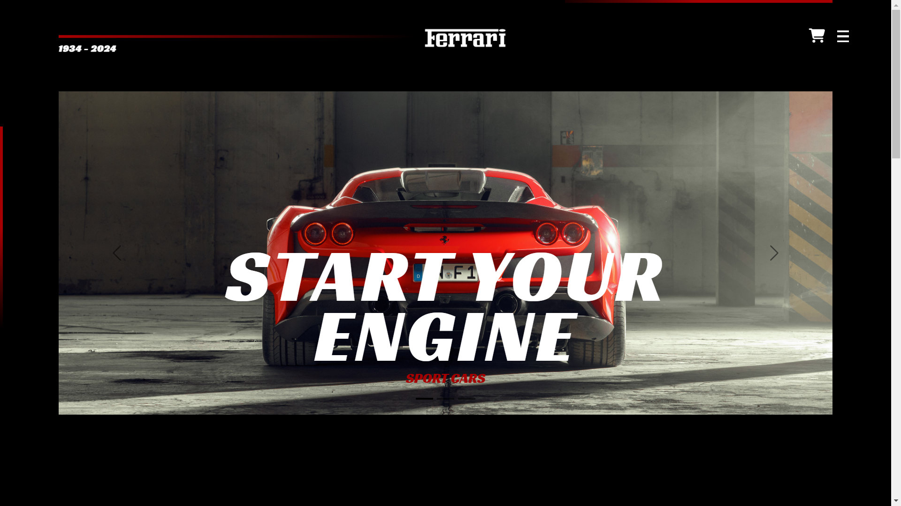
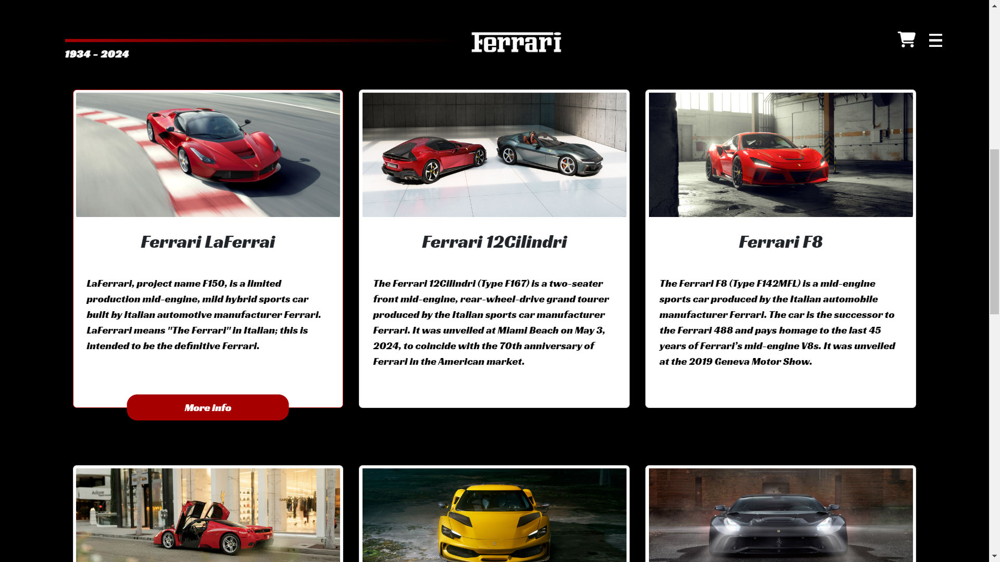
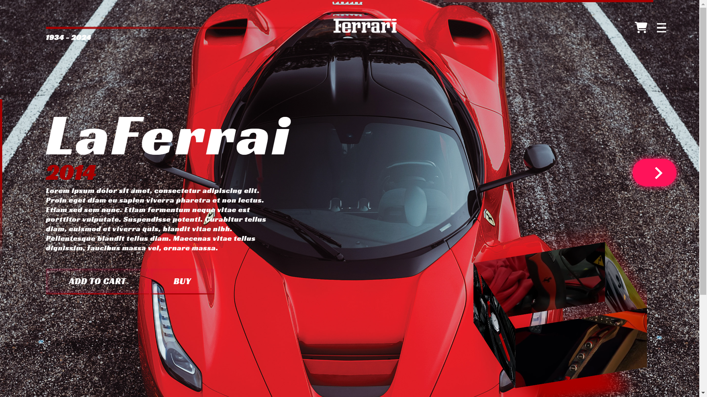
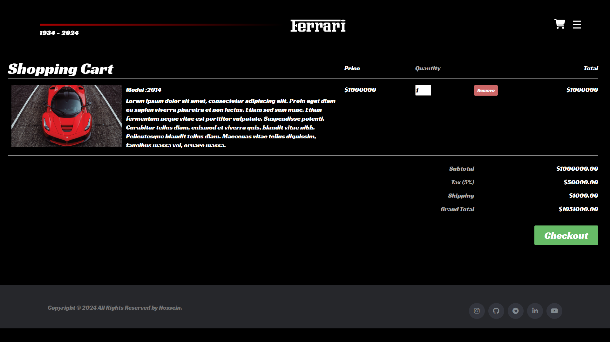
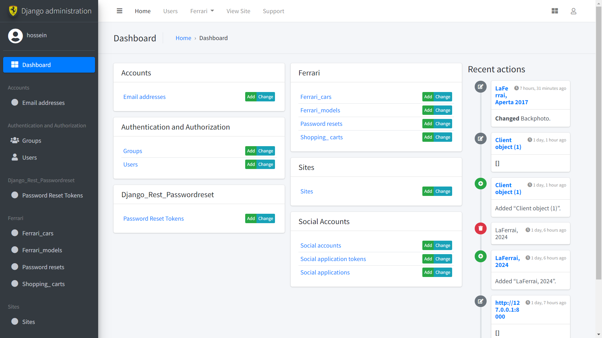

# Ferrari Model Showcase and Shopping

## Project Overview

### Home Page
The home page provides an overview of Ferrari models, featuring high-quality images and links to detailed model pages.



### Models Page
The models page displays a list of available Ferrari models with brief descriptions and navigation options.



### Car Versions Page
On the car versions page, users can view detailed information about different versions of a selected Ferrari model.



### Shopping Cart
The shopping cart page allows users to manage their selected items and view real-time calculations.



### Admin Panel
The admin panel is customized using the Jazzmin package to enhance administrative functionality and appearance.




## Project Description
The Ferrari Model Showcase and Shopping is an advanced web application designed to display Ferrari car models with interactive features. Built with Django for the backend and Html, CSS and JavaScript (including jQuery) for the frontend, the site allows users to explore Ferrari models, view detailed information, manage a shopping cart, and access various functionalities. The project also includes a customized Django admin panel, email-based password reset with a 10-minute expiration link, Google account login integration, and an FAQ page, providing a comprehensive and user-friendly experience which also mobile responsive.


## Distinctiveness and Complexity

### Distinctiveness
This project is distinguished by its focus on Ferrari car models and the advanced features implemented:
- **Specialized Domain:** The application focuses specifically on Ferrari models, providing an in-depth look at various models and versions, which sets it apart from generic e-commerce or social network projects.
- **Dynamic Interactions:** The use of JavaScript and jQuery for real-time content updates and shopping cart calculations enhances user interaction, making the site more engaging and responsive.
- **Admin Panel Customization:** The admin panel is customized using the Jazzmin package, offering an enhanced and user-friendly interface for managing site content.
- **Advanced Authentication and Security:** Features such as password reset via email with a 10-minute expiration link and Google account login provide added convenience and security for users.
- **FAQ Page:** A dedicated FAQ page provides users with detailed information about the site and its features, enhancing user experience and support.
-**Design:** I focused on creating a visually appealing and user-friendly design for the website to ensure an optimal user experience across all devices. The design balances aesthetics with functionality, featuring a clean and intuitive layout that enhances usability on both mobile and desktop screens. By prioritizing responsive design principles, I aimed to provide a seamless and engaging browsing experience for users, regardless of their device or screen size.

##### The website features an interactive browsing system with dynamic content updates and real-time shopping cart calculations. The customized admin panel, achieved through Jazzmin, improves administrative efficiency, while the integration of Google account login and email-based password reset with a time-sensitive link enhances user security and convenience. Additionally, the FAQ page serves as a comprehensive guide for users.

### Complexity
The project involves several advanced technical aspects:
- **Django and JavaScript Integration:** Combining Django’s backend with JavaScript and jQuery for dynamic interactions and real-time calculations demonstrates sophisticated use of both technologies.
- **Customized Admin Panel:** Implementing Jazzmin for customizing the Django admin panel requires a deep understanding of Django’s admin interface and theming capabilities.
- **Enhanced Authentication:** Adding features for password reset via email with a 10-minute expiration and Google account login involves integrating Django’s authentication system with external services and handling secure data transmission.
- **User Support:** The inclusion of an FAQ page provides a structured and helpful resource for users, contributing to the overall user experience.


##### The project’s complexity includes integrating Django with JavaScript and jQuery for real-time updates and calculations, customizing the admin interface with Jazzmin for a better administrative experience, implementing secure authentication features such as Google login and email-based password reset with a 10-minute expiration, and designing an FAQ page to support user queries.

## Features
- **Model Browser:** Explore Ferrari models with detailed descriptions and high-quality images.
- **Dynamic Model Pages:** View detailed pages for each model, including different versions and specifications. The car photos for each version are dynamically added and managed through the Django admin panel, allowing for easy updates and content management.
- **Interactive Shopping Cart:** Manage and calculate cart totals in real-time using jQuery.
- **Customized Admin Panel:** Enhanced Django admin interface using the Jazzmin package for better usability and efficiency.
- **Password Reset:** Secure password reset functionality via email with a 10-minute expiration link.
- **Google Account Login:** Integration with Google accounts for streamlined user authentication.
- **FAQ Page:** A detailed FAQ page to provide guidance and support for users.
- **Responsive Design:** Mobile-friendly design ensuring usability across various devices.
- **Admin Panel:** The Django admin panel, customized using the Jazzmin package, allows administrators to easily manage and update car models and their versions. Photos for each version of the Ferrari models are uploaded and stored in the database through this panel, ensuring that images can be efficiently managed and updated without changing the site code.

## File Structure and Contents

### `views.py`
Contains Django views for handling requests and responses related to Ferrari models, including dynamic content loading and shopping cart management.

### `models.py`
Defines Django models for Ferrari cars, including models, versions, and specifications. Manages data relationships and interactions.

### `static/`
This directory contains all the static assets used in the project:

- **`static/js/`**: JavaScript files that handle interactive features and dynamic content on the frontend, such as AJAX requests and shopping cart calculations.
- **`static/css/`**: CSS files for styling the website, ensuring a visually appealing and responsive design across different devices.
- **`static/Pics/`**: Image & Video files used throughout the website, including high-quality photos of Ferrari models and icons.

### `templates/`
Includes Django HTML templates for rendering pages, integrated with JavaScript and jQuery to enable dynamic content updates.

### `urls.py`
Defines URL routing for the application, linking to the appropriate Django views and facilitating navigation.

### `requirements.txt`
Lists required Python packages for the project, including Django, Jazzmin, and any other dependencies.

### `admin.py`
Customizes the Django admin interface using the Jazzmin package to enhance the admin panel’s appearance and functionality.


## How to Run the Application

To run the application locally, follow these steps:

1. **Clone the repository:**
   ```bash
   git clone https://github.com/me50/hosseinyousfi.git


2. **Navigate into the Project Directory:**
   Change into the project directory:
   ```bash
   cd capstone
   ```


3. **Install Required Dependencies:**
   Install the required Python packages listed in requirements.txt:

   ```bash
   pip install -r requirements.txt
   ```


4. Set Up the Database
   Apply database migrations to set up the necessary database schema:

   ```bash
   python manage.py makemigrations
   python manage.py migrate
   ```

5. **Create a Superuser (Optional):**
   To access the Django admin panel, create a superuser account:
   Follow the prompts to enter your desired username, email, and password.

   ```bash
   python manage.py createsuperuser
   ```
   
6. **Run the Django Development Server:**
   Start the Django development server:

   ```bash
   python manage.py runserver
   ```

7. **Access the Application:**
   Open your web browser and navigate to http://127.0.0.1:8000/ to view the application. You can also access the Django admin panel at http://127.0.0.1:8000/admin/ using the superuser account created earlier.

8. **Additional Configuration (If Necessary):**
   If you need to configure additional settings such as environment variables or external services, refer to the settings.py file and adjust accordingly. Ensure that all required services (e.g., email server for password reset) are properly set up.
   If you want to change the email for reset password you should use your app password of your account.

9. **Stopping the Server**
   To stop the development server, press Ctrl+C in the terminal where the server is running.

## Technologies Used
- Django (Backend framework)
- JavaScript and jQuery (Frontend interactions)
- HTML & CSS (Styling and markup)
- Jazzmin (Admin panel customization)
- Python (Programming language)
- Google OAuth (Login integration)

## License
   This project is licensed under the MIT License - see the [LICENSE](./LICENSE.txt) file for details.
